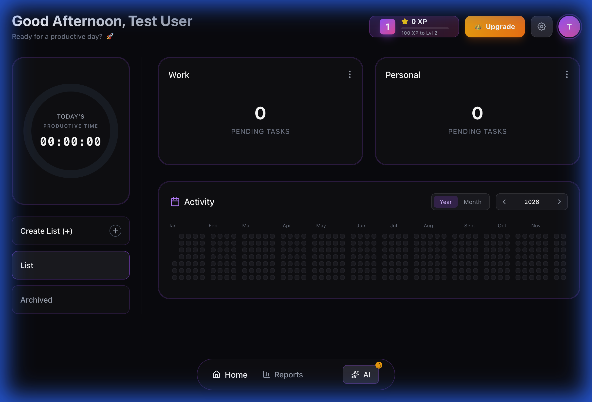

# Prime-it 🚀

**Master Your Chaos.**
Prime-it is a high-performance productivity command center for desktop. It combines task management, focus timers, AI coaching, and gamification into a single, beautiful interface.



## ✨ Features

- **🎯 Command Center:** A unified Kanban board for all your tasks, habits, and goals.
- **⏱️ Hyper-Focus Mode:** Built-in Pomodoro timer that blocks distractions and tracks your flow state.
- **🤖 AI Coach:** Intelligent insights to prevent burnout and optimize your schedule.
- **📊 Analytics:** Visualize your productivity peaks and trends over time.
- **🎮 Gamification:** Earn XP, level up, and unlock achievements as you complete tasks.
- **📱 Mobile Payment:** Seamless "Scan to Pay" integration for Pro features.

## 🛠️ Tech Stack

- **Core:** Electron, React, TypeScript, Vite
- **State:** Zustand (Local + IPC Persistence)
- **Database:** Supabase (PostgreSQL + RLS)
- **Payments:** LemonSqueezy (Webhooks + API)
- **Styling:** TailwindCSS, Framer Motion

## 📦 Installation

To build the app locally:

```bash
# Install dependencies
npm install

# Run in development mode
npm run dev

# Build for production (Mac/Windows)
npm run build
```

## 🔐 Security

- **RLS Enabled:** All user data is row-level secured in Supabase.
- **Secure Payments:** Handled via LemonSqueezy's secure checkout.
- **Local-First feel:** Optimistic UI updates for instant feedback.

## 📄 License

Copyright © 2026 Prime-it Inc. All rights reserved.
